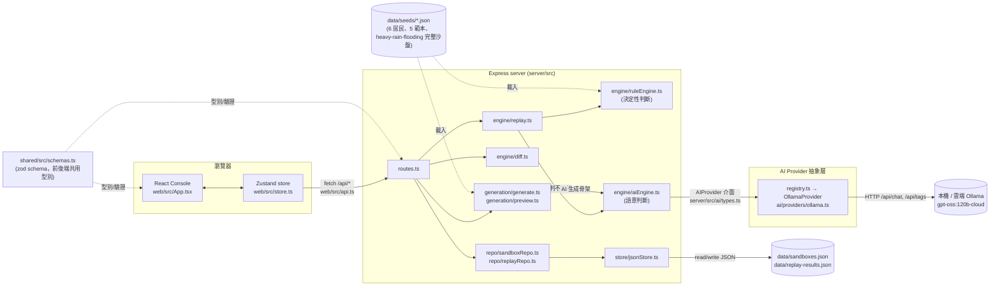
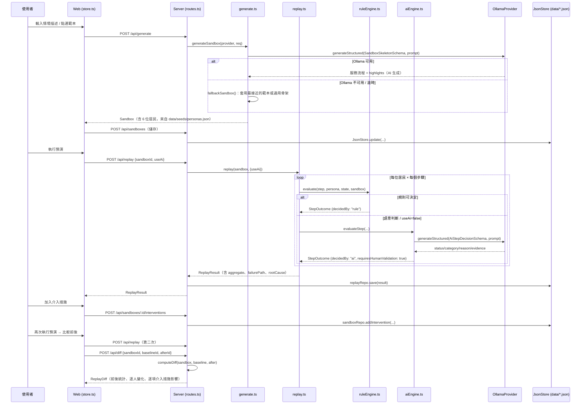

# 系統架構

本文件描述 Civic Replay 目前實際的程式架構，不是規劃中的理想架構。所有路徑皆為
儲存庫內可直接開啟的檔案；「規劃中」段落明確列出尚未實作的部分。

## 總覽



`shared/` 是唯一的資料模型來源：`server` 用它驗證 API 輸入輸出並產生 AI 結構化
輸出的 schema，`web` 用它做型別檢查，兩邊不會各自維護一份型別定義。

## 端到端資料流

以下序列圖對應 README「操作流程」的六個步驟，箭頭上標註實際呼叫的函式：



## 核心資料模型（`shared/src/schemas.ts`）

所有型別皆以 zod schema 定義，同時作為執行期驗證與 AI 結構化輸出的 schema：

| 型別 | 代表什麼 | 由誰產生 |
| --- | --- | --- |
| `Scenario` | 情境主題、地點、事件描述 | AI 生成或範本預設 |
| `Service` / `ServiceStep` | 服務流程步驟（`id`、`label`、`kind`、`intent`、`channels`、`jargon`） | AI 生成或範本預設；`kind` 限定在固定字彙（`alert`/`understand`/`choose_channel`/`prepare`/`verify_identity`/`obtain_result`），規則引擎靠這個欄位判斷 |
| `Persona` + `PersonaConditions` | 居民的結構化條件（`uses_line`、`digital_literacy`、`mobility`、`chinese_reading`、`needs_proxy` 等） | 固定讀自 `data/seeds/personas.json`（6 種原型），依人數需求循環複製 |
| `Intervention` | 介入措施（`type`/`trigger`/`action`/`stepRef`） | 使用者從 `INTERVENTION_CATALOG`（`shared/src/catalog.ts`）挑選加入 |
| `CitizenState` | 單一居民在預演過程中的累積狀態（`aware`、`understands`、`evacuation_info`⋯） | 由每一步的 `StateChanges` 累加（`engine/citizenState.ts`） |
| `StepOutcome` | 單一居民在單一步驟的判定結果（`status`/`category`/`reason`/`evidence`/`decidedBy`/`requiresHumanValidation`） | 規則引擎或 AI 引擎產生 |
| `ReplayResult` | 一次完整預演：每位居民的 `StepOutcome` 序列、`failurePath`、`rootCause`、彙總統計 | `engine/replay.ts` |
| `ReplayDiff` | 兩次 `ReplayResult` 的比較：前後統計、逐人 `before/after`、逐項介入措施影響 | `engine/diff.ts` |
| `PreviewAnalysis` | 沙盤預覽面板用的風險 Top 5、建議介入措施、預估分布 | `generation/preview.ts`（**純規則引擎**，見下方說明） |

## 規則引擎與 AI 引擎的責任劃分

這是本專案的核心設計：**能用明確條件判斷的，一律交給規則引擎**，只有牽涉語意
理解的判斷才呼叫 AI，而且呼叫 AI 產生的每一筆結果都會被標記
`requiresHumanValidation: true`，並在介面上顯示「AI 模擬結果，仍需真人／地方
單位驗證」。

### 規則引擎（`server/src/engine/ruleEngine.ts`）— 純函式、完全決定性

| 判斷類型 | 條件 | 對應步驟 kind |
| --- | --- | --- |
| 存取能力 | 居民能否使用步驟指定的管道（`uses_line`/`has_smartphone`/`has_internet` 等對照 `channels.requires`） | `alert`、`choose_channel` |
| 移動能力 | `mobility === "limited"` 且 `has_vehicle === false`，且步驟需要移動 | 任何 `requiresTravel` 步驟、`obtain_result` |
| 代辦資格 | `needs_proxy === true` 且步驟需要本人親自驗證身分 | `verify_identity` |
| 文件準備 | `digital_literacy`/`chinese_reading`/`needs_proxy` 明確不構成障礙時直接 PASS，構成障礙時才交給 AI | `prepare` |
| 典型居民 | 沒有任何限制條件命中時，直接 PASS，不呼叫 AI | 其餘所有 kind |

規則引擎也負責判斷「有沒有介入措施或備援選項能把 BLOCKED 降為 NEED_HELP」——
這一步同樣是純條件比對（`INTERVENTION_CATALOG` 的 `categories` 是否涵蓋失敗
類別、`stepRef` 是否對得上），不涉及語意理解。

有一項規則明確寫死：**任何跟「這段文字/用詞看不看得懂」有關的判斷**（`understand`
步驟裡，居民的閱讀或數位能力已經構成障礙，但沒有多語言介入措施時），規則引擎會
回傳「未決定」，交給 AI 引擎處理——這是刻意的設計邊界，用測試鎖定
（`server/tests/ruleEngine.test.ts`）。

### AI 引擎（`server/src/engine/aiEngine.ts`）— 呼叫 LLM，僅處理語意判斷

- 收到規則引擎判不了的步驟時，組出一份精簡的 prompt（情境 + 該步驟 + 居民條件
  + 目前 CitizenState + 目前生效的介入措施，`engine/prompt.ts`），呼叫
  `AIProvider.generateStructured(AiStepDecisionSchema, prompt)`。
- AI 回傳的每一筆 `StepOutcome` 一律強制 `decidedBy: "ai"` 且
  `requiresHumanValidation: true`，不管 AI 回傳的內容多有把握。
- AI 呼叫失敗（逾時、連線錯誤、結構化輸出驗證失敗）時**安全降級**：該步驟記為
  `NEED_HELP`，原因寫「AI 未啟用 / 無法判定」，同樣標記需人工確認，預演會繼續
  跑完剩下的步驟與居民，不會整個失敗。
- 卡住居民的 `rootCause`（系統性原因說明文字）也是由 AI 引擎產生
  （`deriveRootCause`），AI 不可用時退回一段規則模板組出的句子
  （`replay.ts` 的 `ruleRootCause`）。

### 容易誤解的一點：沙盤預覽面板的「AI 估算」其實是規則引擎算的

`generation/preview.ts` 的 `analyzeSandbox()`（驅動右側「風險偵測 Top 5」「建議
介入措施」「模擬結果總覽」）**完全沒有呼叫 AI**——它是對規則引擎做一次快速的
乾跑（dry run），把「規則判不了、需要語意判斷」的步驟直接記為不確定風險項。
介面上標示「AI 估算」是產品文案，不是技術事實；真正呼叫 AI 的地方只有「生成
沙盤」（`SandboxSkeletonSchema.highlights`、服務流程）與「執行預演」時規則判不了
的步驟。這個落差值得評審與後續開發者知道。

### 由固定資料決定，跟規則引擎、AI 引擎都無關

- 6 位居民的原型條件（`data/seeds/personas.json`）與 5 個範本的預設設定
  （`data/seeds/templates.json`）都是團隊事先寫好的固定資料，不是任何引擎算出來
  的。
- `heavy-rain-flooding` 這個情境的完整服務流程（`data/seeds/scenario.heavy-rain-flooding.json`）也是手工建置、測試鎖定的固定沙盤，不受 AI 生成結果影響——
  即使 Ollama 在線，選這個範本一樣是讀這份固定 JSON，不會重新呼叫 AI 生成流程
  本身（但選其他範本或自由輸入文字時仍會呼叫 AI 生成流程）。

## AI Provider 抽象層（`server/src/ai/`）

```
AIProvider 介面（ai/types.ts）
  generateStructured<T>(schema, prompt, opts): Promise<T>   // 要求 JSON 輸出並用 zod 驗證
  complete(prompt, opts): Promise<string>
  health(): Promise<AiHealth>
        ↑ 實作
OllamaProvider（ai/providers/ollama.ts）
  - POST {OLLAMA_HOST}/api/chat，format: "json"，model: OLLAMA_MODEL
  - 驗證失敗時（BaseProvider，ai/baseProvider.ts）帶著 zod 錯誤訊息重試一次
    （repair prompt），仍失敗就丟出 AIStructuredOutputError
  - health() 呼叫 {OLLAMA_HOST}/api/tags 確認服務可連線、模型是否已列在本機
        ↑ 選用
registry.ts：依 AI_PROVIDER 環境變數選 provider（目前只註冊 "ollama"），
             未知值會在啟動時直接 fail fast（server/src/index.ts）
```

`replay.ts`、`aiEngine.ts`、`generate.ts` 全部只依賴 `AIProvider` 這個介面，
沒有任何地方直接 import Ollama 的型別或 SDK——這是刻意的邊界，讓「新增 OpenAI
provider」理論上只需要新增一個實作並在 `registry.ts` 註冊一行，不用改引擎程式碼
（**這件事本身尚未實作**，目前只有 Ollama 一種 provider）。

## 持久化（`server/src/store/jsonStore.ts`）

沒有資料庫。`JsonStore<T>` 把整份資料存成一個 JSON 檔（`data/sandboxes.json`、
`data/replay-results.json`），寫入時：

1. 同一個 store 實例的所有寫入排成一條 Promise 鏈，避免同時寫入互相覆蓋；
2. 每次寫入先寫到暫存檔（`*.pid.timestamp.tmp`）再用 `rename` 原子性換檔，避免
   寫到一半的檔案。

`data/seeds/*.json` 是唯讀的固定資料，`.gitignore` 只排除 `data/*.json`（執行期
產生的資料），seeds 目錄本身會被提交進版控。

## 關鍵程式路徑索引

| 功能 | 路徑 |
| --- | --- |
| API 路由 | `server/src/routes.ts` |
| 沙盤生成 / 預覽分析 | `server/src/generation/generate.ts`、`preview.ts`、`merge.ts`、`prompt.ts` |
| 規則引擎 | `server/src/engine/ruleEngine.ts` |
| AI 引擎 | `server/src/engine/aiEngine.ts`、`engine/prompt.ts` |
| 預演主流程 | `server/src/engine/replay.ts`、`engine/citizenState.ts` |
| Replay Diff | `server/src/engine/diff.ts` |
| AI provider 抽象層 | `server/src/ai/types.ts`、`ai/baseProvider.ts`、`ai/providers/ollama.ts`、`ai/registry.ts` |
| JSON 持久化 | `server/src/store/jsonStore.ts`、`repo/sandboxRepo.ts`、`repo/replayRepo.ts` |
| 共用型別 / schema | `shared/src/schemas.ts`、`shared/src/catalog.ts` |
| 固定資料 | `data/seeds/personas.json`、`templates.json`、`scenario.heavy-rain-flooding.json`，讀取邏輯在 `server/src/seeds.ts` |
| 前端主畫面 / 狀態 | `web/src/App.tsx`、`web/src/store.ts`、`web/src/api.ts` |
| 前端主要元件 | `web/src/components/{SandboxFlow,Personas,SandboxPreview,ReplayView,GenerationSettings,MySandboxes}.tsx` |

行為規格（含每個 Requirement 對應的驗收情境）在 `openspec/specs/`，逐項對應到
測試檔案的追溯表在 `openspec/changes/archive/2026-09-04-civic-replay-mvp/notes.md`。

## 規劃中／明確不在範圍內

以下項目**尚未實作**，文件與介面上出現類似字眼時請以此處為準：

- **OpenAI（或其他 provider）支援**：`AIProvider` 介面已經為此設計，但目前
  `registry.ts` 只註冊了 Ollama 一種，尚未新增第二個實作。
- **居民生成器**：目前只有 6 種固定原型，人數設定超過 6 時是循環複製既有原型並
  加上編號，不是生成新的、獨立的居民樣態。
- **針對其他 4 個範本的完整驗證沙盤**：目前只有 `heavy-rain-flooding` 有手工
  建置並測試鎖定的完整內容；其餘範本在沒有 AI 時只會得到通用骨架（見
  `generate.ts` 的 `fallbackSandbox()`）。

以下項目是**專案明確排除的範圍**（見
`openspec/changes/archive/2026-09-04-civic-replay-mvp/proposal.md` 的
「Out of scope / Future Work」），不是暫緩實作的待辦事項：真實政府帳號或居民
資料、操作正式政府網站、Browser Agent（自動操作瀏覽器 / 網站的代理）、PDF
表單解析、法規判定、資料庫、帳號與多人協作、分享連結、完整無障礙稽核。
