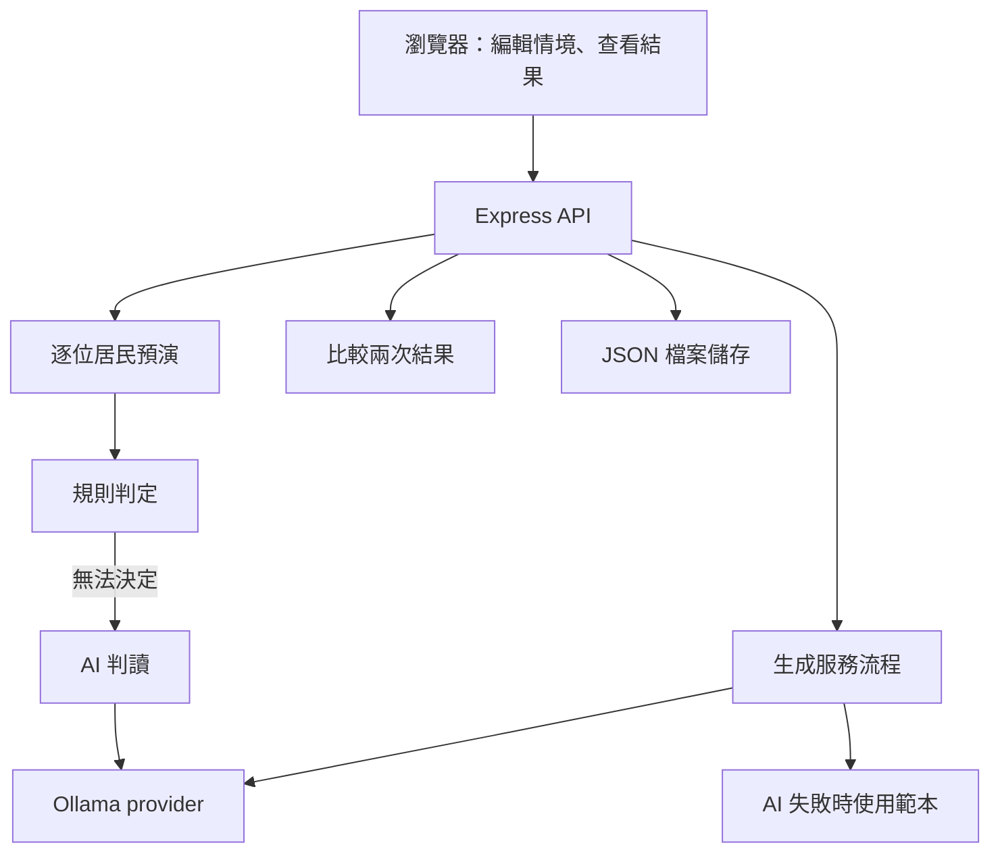

# 系統架構

Civic Replay 把一份公共服務情境拆成流程、居民條件與協助措施，再逐步預演。前端負責編輯與呈現，後端負責生成、判定、比較和儲存。

## 程式分成三個套件

| 目錄 | 工作 |
| --- | --- |
| `web/` | React 介面；Zustand 管理編輯狀態，TanStack Query 取得 API 資料，Vite 負責開發與建置 |
| `server/` | Express API、情境生成、規則與 AI 判定、前後比較、JSON 儲存 |
| `shared/` | 前後端共用的 TypeScript 型別、Zod schema 與協助措施目錄 |

生成流程直接呼叫 provider；預演中的 AI 判讀則由 `engine/aiEngine.ts` 處理。

## 一次操作如何流經系統

1. `POST /api/generate` 接收描述與設定。`generation/generate.ts` 先要求 AI 輸出符合 schema 的流程，失敗才以文字相似度選擇備援範本。
2. `POST /api/preview` 以規則快速檢查沙盤，回傳風險、建議措施與結果分布，不呼叫 AI。
3. `POST /api/sandboxes` 儲存沙盤；`POST /api/replay` 依沙盤 ID 執行預演，並儲存結果。前端會先儲存再預演。
4. `POST /api/sandboxes/:id/interventions` 加入措施；移除時使用同一路徑加上 `/:iid` 的 `DELETE` 請求。
5. 再次預演後，`POST /api/diff` 比較指定的兩筆結果。沙盤可透過 `GET /api/sandboxes/:id/export` 匯出。

其餘清單、讀取、更新與健康檢查路由見 `server/src/routes.ts`。

## 主要資料

資料結構定義於 `shared/src/schemas.ts`。

| 型別 | 內容 |
| --- | --- |
| `Sandbox` | 情境、服務流程、居民、介入措施、生成設定與編輯紀錄 |
| `ServiceStep` | 步驟名稱、用途、管道與 `kind`；目前共有六種步驟類型 |
| `Persona`／`PersonaConditions` | 居民的裝置、閱讀、移動、代辦需求等條件；目前來自六種固定原型 |
| `CitizenState`／`StepOutcome` | 居民走到目前步驟的累積狀態，以及結果、原因、證據、判定來源 |
| `ReplayResult`／`ReplayDiff` | 一次預演的逐人結果，以及兩次預演的統計與狀態差異 |

居民不是每次由 AI 重新生成。一般生成路徑在人數超過六位時會重複原型並加上編號；完整豪雨備援範本則只取既有居民，最多六位。

## 規則和 AI 各自判斷什麼

`engine/ruleEngine.ts` 依步驟種類與居民條件判斷：通知管道是否可用、能否移動、是否需要代辦，以及哪些協助措施可用。文字理解和部分文件準備問題無法由既有條件決定時，才交給 `engine/aiEngine.ts`。

AI 結果會標記 `decidedBy: "ai"` 與 `requiresHumanValidation: true`。AI 呼叫失敗，或預演指定 `useAi: false` 時，未決步驟記為 `NEED_HELP`。其中 `decidedBy: "ai"` 也用於「AI 未啟用」的未決結果，不能單憑這個欄位認定實際呼叫過模型。

每位居民遇到第一個 `BLOCKED` 就停止往後走。最終狀態依以下順序決定：有任何步驟無法完成就是 `BLOCKED`；否則有步驟需要協助就是 `NEED_HELP`；全部通過才是 `PASS`。

協助措施可能讓 `BLOCKED` 變為 `NEED_HELP`，表示仍需要有人協助。這不等於已完成真實申請，也不代表居民能自行完成。

## 前後比較的範圍

`engine/diff.ts` 比較居民狀態，依結果中記錄的措施，或失敗類別的對應關係，列出可能相關的措施。這是程式內的歸因方式，不能當成已證明的政策因果效果。

| 指標 | 目前計算方式 |
| --- | --- |
| `Reached` | 已走到最後一步，或最終狀態不是 `BLOCKED` 的人數；最後一步卡住的人也可能計入 |
| `Able to act` | 最終狀態為 `PASS` 的人數 |
| `Unresolved` | 最終狀態為 `BLOCKED` 的人數 |

前端以措施數最少的一次作為比較基準，以最新結果作為修改後版本。相同措施指紋的重跑會取代畫面中的舊結果。後端有儲存結果，但尚未保留完整且固定的情境快照，也沒有完整比對兩次居民與服務設定是否一致。

因此，展示比較時應使用同一份沙盤，只改介入措施，不要同時改居民或重新生成情境。先前提出的「固定所有情境條件，只修改政策規則」是後續功能，不能視為已完成。

## AI 連線與備援

目前只註冊 `ollama` provider，預設模型為 `gpt-oss:120b-cloud`。`ai/providers/ollama.ts` 呼叫 `/api/chat`，`ai/baseProvider.ts` 驗證結構化輸出，驗證失敗時帶入錯誤資訊重試一次。

`/api/health/ai` 使用 Ollama 的 `/api/tags` 檢查連線。可連線但模型未列出時，仍回傳 `available: true`，並附上 `reason`；這不保證後續推論成功，也不能直接判定雲端模型不可用。

所有情境，包括豪雨範本，都會先嘗試 AI 生成。只有生成失敗才會用範本；離線豪雨示範的固定數字不能套用到 AI 生成的版本。新增 OpenAI API provider 需要實作與測試，目前只是保留共用介面。

## 儲存與資料使用

`store/jsonStore.ts` 將沙盤與預演結果存入 `data/sandboxes.json`、`data/replay-results.json`。同一個 store 的寫入會排隊，先寫暫存檔再換檔。這不是多伺服器資料庫，沒有帳號或存取權限系統。

`CIVIC_DATA_DIR` 可指定執行資料目錄；固定範本仍從 `data/seeds/` 讀取。匯出只包含沙盤，不包含完整預演結果。

AI 提示會帶入使用者描述、服務內容、居民條件與目前步驟等資料。內建居民為合成資料，但系統不會自動阻止使用者輸入個資；使用雲端模型時，這些提示會送往模型服務。

## 現有模型的限制

目前的 `eligibilityRules` 主要是文字資料，尚未逐條執行完整資格、期限、OTP 或必備文件驗證。部分條件也有簡化假設，例如生成時可能自動補入現場管道、一般備援選項可讓管道障礙改為需要協助。

目前仍沿著每位居民的服務步驟預演，沒有完整枚舉所有申請路徑，也沒有 `no_viable_path` 終局。右側預覽雖標為「AI 估算」，實際只使用規則；應以完整預演與個別原因判讀。

以上都是後續政策模擬功能需要補足的地方。現版本沒有串接政府網站、解析 PDF、操作真實帳號，或審查正式法規。

## 程式入口

| 工作 | 路徑 |
| --- | --- |
| 生成、預覽、保留編輯 | `server/src/generation/` |
| 規則、AI 判讀、預演、比較 | `server/src/engine/` |
| API、模型連線、儲存 | `server/src/routes.ts`、`server/src/ai/`、`server/src/store/` |
| 共用資料結構與措施 | `shared/src/schemas.ts`、`shared/src/catalog.ts` |
| 畫面與前端狀態 | `web/src/App.tsx`、`web/src/components/`、`web/src/store.ts` |
